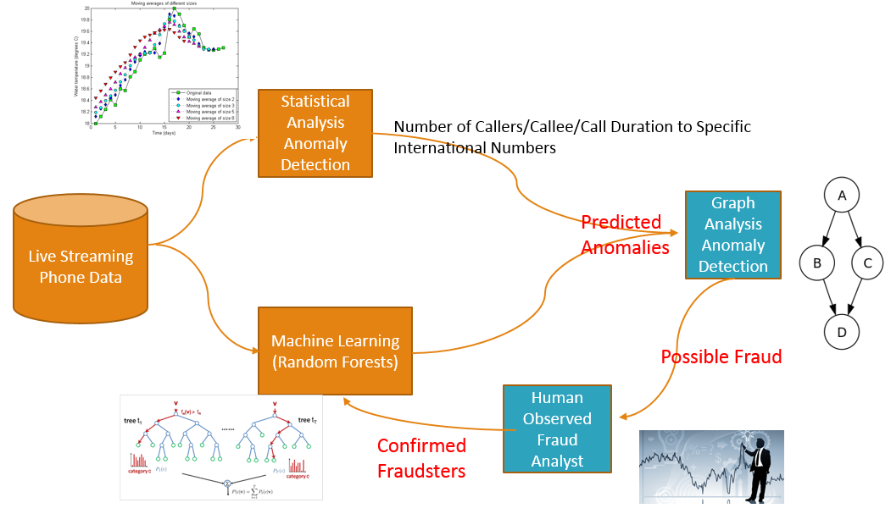

This project is to identify fraudsters using a hybrid of statistical, machine learning and graph techniques. The statistical analysis takes a time window and analyzes the raw log to derive cumulative statistics upon which anomalies are identified (items that are significantly different than the norm). At the same time, the machine learning classifier would take the same raw data within the time window and classify items that are anomalous. 

Now having identified these anomalous items, we then apply a graph analysis on these items. Taking a longer time window (since a longer history may provide further evidence as to whether these items are indeed fraudsters), we model the nodes as the items and the directed edges as which node communicates with which other node. Having this graph, we then perform a classification using graph metrics, where we derive metrics such as triangle count and identify nodes that have the weakest communities. 

Now the nodes that were identified from the graph analysis are much more likely to be fraudster. These nodes are then passed to a human fraud analyst for confirmation. Once the confirmation is provided then this labeled data is provided as training data for the previously mentioned random forest classifier. 

###Results

The project visualization can be seen on www.fraud-detector.net . The concept implementation using public test data, indicated that the approach successfully identified nodes that appeared to be suspicious in nature. However, further work is necessary to confirm that the graph metrics used are indeed defining how a fraudster behaves.

###Motivation
-----------

$2 billion dollars a year is lost due to a specific type of telecommunication fraud. 

The challenge is to identify the fraudsters while strictly minimizing the number of false positives. 

Legacy Approach
----------------

The legacy approach employs a statistical treatment where phone numbers that get or make excessive calls are examined further by a human analyst. 

Limitations of Current Solution
-------------------------------

Smart fraudsters maybe able to fool statistical detection means by adapting their fraud call rates such that the rates are within the moving average windows. The other limitation is that this approach is prone to false positives which are very costly and creates a sense of disbelief on the fraud detection system in general.

Solution
--------

This project presents a solution where a hybrid approach comprising of statistical, machine learning and graph analysis would be employed to minimize the false positives. The statistical and machine learning classifiers would identify phone numbers that are suspicious and then graph analysis metrics would be employed to further refine this list of phone numbers to those phone numbers that exhibit calling patterns that represent those of suspected fraudsters. For example, fraudsters tend to call random individuals who most likely dont know each other. In graph theory, the metric that could quantify this could be 'triangle count'. Using these graph metrics analysis, the number of false positives can be reduced.

Code Structure 
--------------
The code is structured as the data flow diagram, where each box is encapsulated by a code file. The main file is called Fraud_Detection.py while the other files capture the rest of the flow. Fraud Detection.ipynb is an ipython notebook that captures the various pipeline segments.

Data Source
-----------
This project was done in the context of a hackathon where they sponsors provided data of their call traffic (phone numbers were deidentified). 

Technologies
------------
Postgres SQL, NetworkX, GraphLab (prototyped only), Spark (prototyped only), Python, Flask, D3 Javascript
